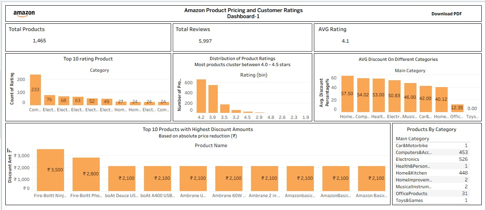
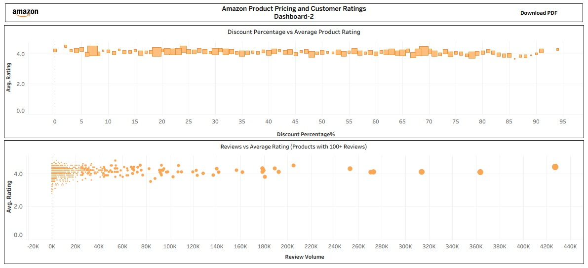

# 📊 Amazon Pricing & Customer Rating Analysis  
### Interactive Business Intelligence Dashboard using Tableau

---

## 🔍 Project Objective

The goal of this project is to analyze Amazon product pricing strategies, discount patterns, and customer rating behavior using Tableau.  
This dashboard identifies relationships between pricing decisions, review volume, and product performance to support data-driven business decisions.

---

## 📁 Dataset Overview

- **Total Products:** 1,465  
- **Total Reviews:** 5,997  
- **Average Rating:** 4.1  
- Categories include Electronics, Computers, Home & Kitchen, Health & Personal Care, Office Products, Toys & Games, and more.

### Data Fields Used:
- Product Name  
- Category  
- Price  
- Discount Amount  
- Discount Percentage  
- Customer Rating  
- Review Count  

---

## 📊 Dashboard 1 – Pricing & Rating Overview

This dashboard provides a high-level performance summary.

### Key Visualizations:
- Top 10 Highest Rated Products
- Rating Distribution (Binned Analysis)
- Average Discount % by Category
- Top 10 Products with Highest Absolute Discount (₹)
- Product Count by Category

### Purpose:
To understand overall pricing trends and rating distribution across categories.
---

## 📸 Dashboard Screenshots

### 📊 Dashboard 1 – Pricing & Rating Overview

---

## 📈 Dashboard 2 – Relationship Analysis

This dashboard focuses on analytical relationships between pricing and customer perception.

### Key Visualizations:
- Discount % vs Average Rating (Scatter Plot)
- Review Volume vs Average Rating (Products with 100+ Reviews)

### Purpose:
To analyze whether discount strategies influence customer satisfaction and rating behavior.

### 📈 Dashboard 2 – Relationship Analysis

---

## 🔎 Key Insights

1. Most products fall within the **4.0–4.5 rating range**, indicating strong overall customer satisfaction.
2. Higher discount percentages do not negatively impact average product ratings.
3. Products with high review volumes consistently maintain ratings above 4.0, showing strong customer trust.
4. Electronics and Computers categories dominate product distribution.
5. Some products show extremely high absolute discounts (₹3,000+), suggesting aggressive pricing strategies.

---

## 🛠 Tools & Techniques Used

- Tableau Desktop  
- Calculated Fields (Derived Metrics)  
- Rating Binning for Distribution Analysis  
- Aggregations (AVG, COUNT, SUM)  
- Interactive Category Filters  
- Scatter Plot Correlation Analysis  
- KPI Design & Dashboard Formatting  
- Category-wise Comparative Analysis  

---

## 🎯 Business Value

This dashboard enables:

- Evaluation of pricing effectiveness  
- Understanding of rating behavior across categories  
- Identification of high-performing product segments  
- Analysis of discount strategies without impacting customer satisfaction  

This project demonstrates practical business intelligence application using real-world e-commerce data.

---

## 📂 Project Files

- `.twbx` – Packaged Tableau Workbook  
- `.xlsx` – Source Dataset  
- Dashboard Screenshots  

---

## 🚀 Future Enhancements

- Add parameter-driven comparison views for dynamic analysis  
- Implement advanced calculated fields for deeper insights  
- Incorporate time-based trend analysis (if date data is available)  
- Extend analysis using SQL or Python for further data exploration  

