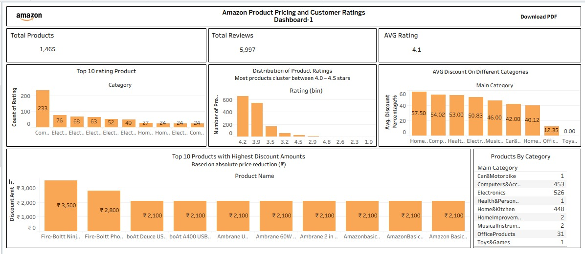
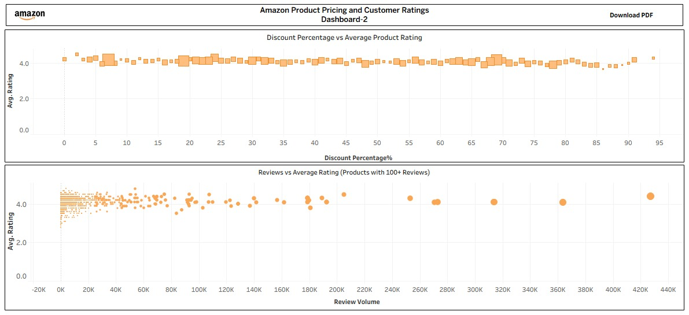

# 📊 Amazon Pricing & Rating Analysis Dashboard (Tableau)

🚀 Analyzed **1,465 Amazon products** to uncover pricing trends, discount strategies, and customer rating behavior.

🔑 **Key Insight:** Higher pricing and discounts do not necessarily lead to better ratings, revealing inefficiencies in pricing strategies.

---

## 📌 Project Summary

- Built an interactive **Tableau dashboard** to analyze product pricing and customer ratings  
- Performed data cleaning and transformation using **Excel and SQL**  
- Developed KPIs including:
  - Average Rating: **4.1**
  - Price Distribution  
  - Category-wise Performance  
- Implemented filters and parameters for dynamic, real-time analysis  

---

## 📊 Dashboard Overview

### 🔹 Dashboard 1 – Pricing & Rating Overview

This dashboard provides a **high-level summary of product performance** across categories, focusing on pricing patterns and customer ratings.

**Key Visualizations:**
- Top 10 Highest Rated Products  
- Rating Distribution (Binning Analysis)  
- Average Discount % by Category  
- Top Products with Highest Discount Amount (₹)  
- Product Count by Category  

**Purpose:**  
To understand overall pricing trends, discount strategies, and rating distribution across product categories.

---

### 🔹 Dashboard 2 – Relationship Analysis

This dashboard focuses on **analyzing relationships between discounts, review volume, and customer ratings**.

**Key Visualizations:**
- Discount % vs Average Rating (Scatter Plot)  
- Review Volume vs Average Rating (Products with 100+ Reviews)  

**Purpose:**  
To evaluate whether pricing strategies and customer engagement impact product ratings.

**Observation:**  
No strong correlation observed between discount percentage and product ratings.

---

## 📸 Dashboard Screenshots

### 📊 Dashboard 1 – Pricing & Rating Overview

### 📈 Dashboard 2 – Relationship Analysis

---

## 🔎 Key Insights

- Most products fall in the **4.0–4.5 rating range**, indicating strong customer satisfaction  
- Discounts do **not negatively impact ratings**  
- Products with high review counts maintain ratings above 4.0, showing strong customer trust  
- Electronics & Computers dominate product categories  
- Some products show **₹3000+ discounts**, indicating aggressive pricing strategies  

---

## 🛠 Tools & Techniques

- Tableau Desktop  
- Excel & SQL (Data Cleaning & Transformation)  
- KPI Development  
- Data Aggregation (AVG, COUNT, SUM)  
- Scatter Plot Analysis  
- Interactive Filters & Parameters  

---

## 🎯 Business Value

- Helps evaluate pricing effectiveness  
- Identifies high-performing product segments  
- Supports data-driven pricing decisions  
- Analyzes relationship between discounts and customer satisfaction  

---

## 📂 Project Files

- Tableau Workbook (.twbx)  
- Dataset (.xlsx)  
- Dashboard Screenshots  

---

## 🚀 Future Improvements

- Add time-based trend analysis  
- Perform advanced analysis using Python  
- Build predictive models for pricing optimization  
